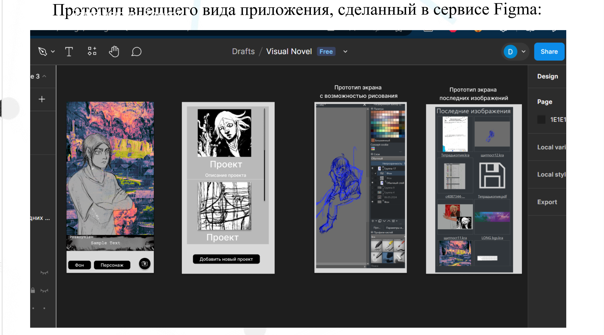
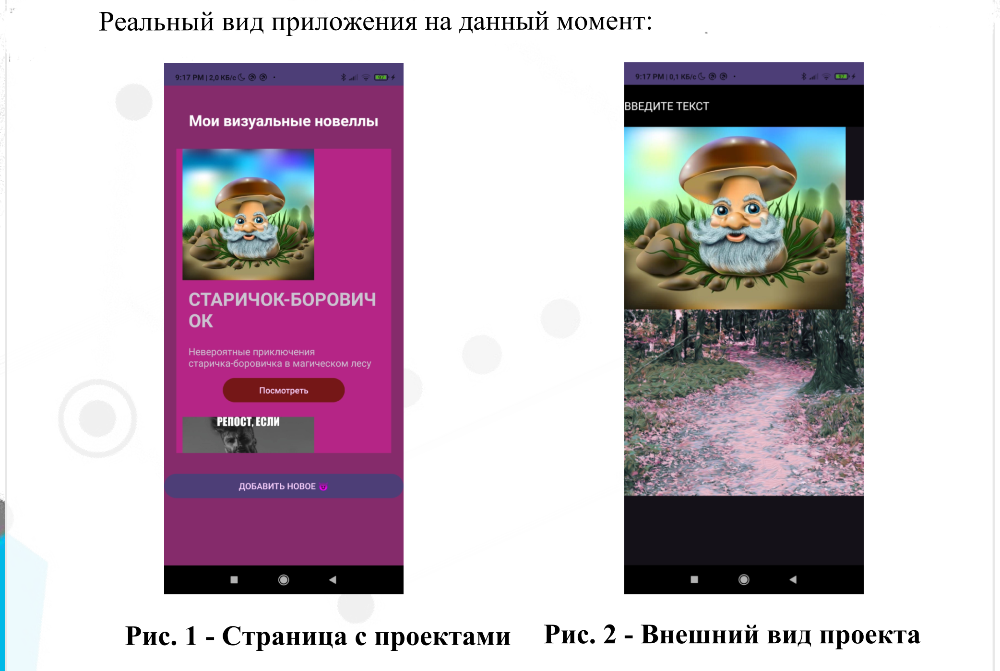

ладно по чесноку я это сделала за четыре дня к курсу по андройд разработке самсунга.  
я бы больше вложила усилий, но, увы, мне надо было ещё написать курсач про кольцевой мост в микрополосковом исполнении  

**[Видео-демонстрация работы приложения](https://disk.yandex.ru/i/s1pHav5XhxUwlQ)**    

  

